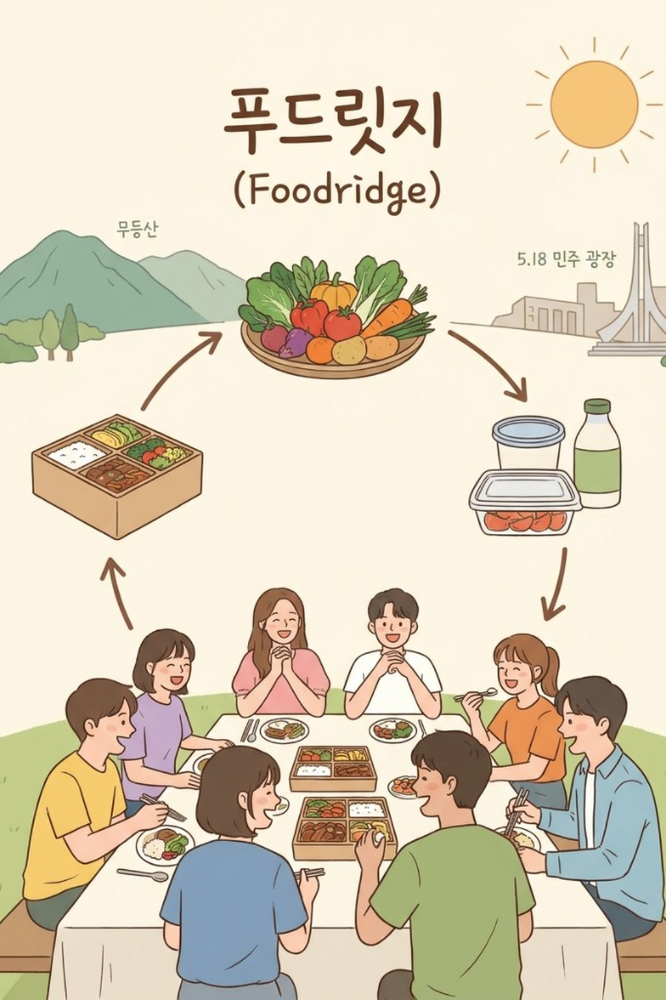

<p align="center">
  
</p>

# Foodridge

광주·전남 대학가의 **식자재·잉여 식품 선순환**과 **청년 식비 부담 완화**를 한 앱에서 다루는 Flutter 프로젝트입니다.

사업성보다 **공공성**을 앞세운 종합 푸드 셰어링 플랫폼입니다. 공공기관·대학 정책에 맞추어 설계되었고, 민간 배달 앱처럼 점주에게 수수료를 걷는 구조가 아닙니다.

지금은 **서버/DB 없이 데모 계정**으로 역할별 화면을 확인할 수 있습니다. Firebase Authentication · Firestore는 패키지만 들어 있고, 실제 로그인·저장은 `DemoAuthStore`와 메모리 Provider가 담당합니다.

---

## 핵심 취지

흥미로운 **참여형 요소**(식권, 응원 순위, 리뷰 리워드)를 도입해 지역사회 안 식자재와 잉여 식품의 선순환을 장려하고, 대학생·청년의 식비 부담을 낮춥니다.

세 서비스가 하나의 통합 앱에 들어가며, **재료의 쓰임이 갈립니다.**

| 재료 | 어디로 가는가 | 쓰지 않는 곳 |
|------|----------------|--------------|
| **B급 농산물** (외관·규격 때문에 유통이 어려운 농산물) | **친구카세**만. 조리학과 팀이 학생식당에서 조리 | 자판기(환승반찬)에 넣지 않음 |
| **미배식 완제품** (급식소에서 조리는 끝났으나 배식되지 않은 온전한 음식) | **환승반찬**만. 수거 후 대학 무인 자판기 | 친구카세 조리 재료로 쓰지 않음 |
| **마감 임박 메뉴** (외국인·특수 식단 식당) | **MealPick** 픽업 | 배달 대행이 아님 |

수거된 물품은 **전부 환승반찬**으로 갑니다. 친구카세는 **B급 농산물만** 씁니다.

---

## 한 줄 요약

| 축 | 무엇을 하는가 | 푸는 문제 |
|----|----------------|-----------|
| **친구카세** | 조리학과 팀이 B급 농산물로 14~15시에 대학 학생식당에서 키친을 연다. 식권 1,000원, 응원, 리뷰. | **시간의 빈곤**(정규 점심을 놓친 학생), 식비, B급 농산물 폐기, 실습 기회 |
| **환승반찬** | 공공 급식소의 미배식 잔반을 수거해 대학 자판기에 균등 입고. 200g / 1,000원. | **급식 폐기**, 특정 학교로 반찬이 몰리는 편중, 청년 한 끼 비용 |
| **MealPick** | 할랄·비건 등 외국인 운영 가게의 마감 할인 픽업. 화면은 영어. 점주 수수료 없음. | **특수 식단·언어 장벽**, 국내 배달 앱 입점 어려움, 마감 폐기 |

앱은 **역할(대학생 / 점주 / 기관 / 운송기사 / 관리자)** 에 따라 같은 하단 탭을 쓰되, 못 쓰는 메뉴는 막아 둡니다.

---

## 왜 공공 플랫폼인가

이 앱은 민간 배달 중개와 경쟁하기 위한 서비스가 아닙니다. **공공기관·대학 정책** 안에서 남는 식자재와 청년을 잇는 것이 목적입니다.

- **외국인 점주 수수료 0원.** 배민·쿠팡이츠처럼 중개 수수료를 받지 않습니다. 국내 배달 앱 입점이 어려운 Halal / Vegan / Vegetarian / 중식·일식 점주가 마감 상품을 올릴 수 있게 합니다.
- **공급처는 공공·급식·농가.** 공공기관 구내식당, 집단 급식소, B급 농산물 재배 농가, 대학 조리학과·학생식당.
- **물류는 공공 입찰 기사.** 수거·자판기 입고 동선은 기사용 앱에서 최적 경로로 안내합니다.
- 따라서 구현·카피도 **사업 매출보다 순환·접근성·공정 분배**를 우선합니다.

---

## 사업 구조

### 핵심 파트너

| 구분 | 역할 |
|------|------|
| **공급처** | 공공기관·구내식당(미배식 완제품) / B급 농산물 재배 농가(친구카세 식자재) / 외국인·특수 식단 식당 점주(MealPick, 수수료 없음) |
| **운영 협력** | 지역 대학 조리학과(요리·실습), 대학교 학생식당(배식 공간·자판기 설치) |
| **물류 협력** | 수거·입고 배송 기사 (공공 입찰) |

### 목표 고객

- 지역 대학생 — 특히 **14~15시에 점심을 놓친 학생**, 저렴한 한 끼가 필요한 청년
- 지역 청년 전반
- 국내 거주 외국인·유학생 — 할랄·비건 등 특정 식단, 언어 장벽으로 기존 배달 앱이 어려운 층

### 가입·인증 (정책)

| 이용자 | 인증 |
|--------|------|
| 한국인 청년·대학생 | PASS(청년 인증). 데모에서는 주민등록 뒷자리 등 폼으로 대체 |
| 외국인 유학생·교환학생 | 대학교 이메일(`.ac.kr` 등) 또는 학생증. 데모에서는 학교 + 체류 시작·종료일 |

교환학생은 **체류 종료일 다음날부터 로그인하면 자동 탈퇴**됩니다.

---

## 누가 무엇을 쓰나

로그인 후 화면은 역할마다 홈 인사·마이페이지 메뉴가 달라집니다. 하단 탭은 공통입니다.

| 탭 | 이름 | 대학생 | 점주 | 기관 | 기사 | 관리자 |
|----|------|:------:|:----:|:----:|:----:|:------:|
| 1 | 홈 | ○ | ○ | ○ | ○ | ○ |
| 2 | 친구카세 | ○ | ✕ | ✕ | ✕ | ○ |
| 3 | 환승반찬 | ○ | ✕ | ○ | ○ | ○ |
| 4 | MealPick | ○ | ○ | ✕ | ✕ | ○ |

- **대학생**: 환승반찬 재고 조회, 친구카세(식권·응원·리뷰), MealPick 예약·픽업, 기여 무게 표시
- **점주**: MealPick 메뉴 등록(수수료 없음). 화면은 영어
- **기관**: 점심 이후 미배식 잔반 수거 신청(오후 3시 마감 정책). 지점 선택은 기사가 Queue로 배정
- **운송기사**: 수거 동선(네이버맵), 수거 완료 체크, 자판기 입고(전역 번호 1~120)
- **관리자**: 위 기능 + 신고 관리, 입고 확정, 다음날 잔여 폐기 운영

---

## 핵심 기능과 비즈니스 로직

### 1. 친구카세 (조리학과 연계 · B급 농산물만)

지역 **B급 농산물만** 써서, 대학 조리학과 팀이 **자교 또는 타교 학생식당**에서 14:00~15:00에 배식합니다. 정규 점심을 놓친 학생의 **시간 빈곤**을 겨냥합니다.

데모 팀은 조리학과 학교를 **요리팀**으로, 행사장는 친숙한 대학 학생식당으로 교차 배정합니다. 예: 호남대 요리팀 / 전남대 학생식당, 광주대 요리팀 / 조선대 학생식당.

| 요리팀 | 학생식당 |
|--------|----------|
| 호남대 요리팀 | 전남대 학생식당 |
| 광주대 요리팀 | 조선대 학생식당 |
| 광주여대 요리팀 | 전남대 학생식당 |
| 순천대 요리팀 | 조선대 학생식당 |
| 전남대 요리팀 | 광주대 학생식당 |
| 조선대 요리팀 | 광주대 학생식당 |

포스터: 참가팀 6 · 지역 2(광주·전남) · 운영 기간 9–12월 · 학교당 식권 100장.  
데모 일정: **9월 완료분(리뷰)** + **10월 1~4일 예약**.

**사전 매칭 (정책)**  
수강 신청 기간에 조리학과 학생이 친구카세 실습을 신청하고, 참여 명단·일정이 확정됩니다. (앱 데모는 확정된 6팀 시드)

**일정 안내**  
각 대학 학생식당에서 열릴 요리 일정을 앱에 올려, 원정 방문 일정을 맞출 수 있게 합니다. 일정 카드에는 팀(어느 학교 요리팀인지), 날짜, 장소, 메뉴, 잔여 식권이 한 화면에 있습니다.

**식권 예약**

- 현장 발권만 하면 방문하고도 못 먹을 수 있어, **앱에서 1,000원 선결제·예약**
- 학교당 **100장**, 같은 날 **1장만**
- 예약 직전 안내 팝업: 한정 수량, 당일 중복 예약 불가 등
- **무료 식권**(리뷰 5회마다 1장, 홈/포스터/마이페이지에서 수량 확인)이 있으면  
  1) 보유 식권을 눌러 사용 여부 확인 → 일정 화면  
  2) 결제에서 **무료 식권 사용** vs **1,000원 결제**
- 발권 직후 리뷰 화면으로 가지 않고, *식권이 완료되었습니다. 식사를 마친 후 리뷰를 남겨주세요* 만 띄움
- 리뷰는 **식권 예약 내역** 또는 **리뷰 탭**에서만 작성

**평가·보상**

- 일반 학생: 0~5점 별점 + 리뷰. **5회마다 무료 식권 1장**
- 조리학과: 누적 별점을 학기 말 실습 **Pass/Fail** 기준으로 반영 (정책). 앱은 학교별 평균 별점·리뷰 목록을 보여 줌

**응원 (게이미피케이션)**

- 유저당 **하루 1회**, 한 요리팀만
- 실시간 순위. 순위가 바뀌면 행이 실제로 자리를 바꿈. 데모는 다른 이용자 응원을 흉내 내 라이브처럼 보이게 함

---

### 2. 환승반찬 (무인 자판기 · 미배식 완제품만)

공공기관·집단 급식소에서 **조리는 끝났으나 배식되지 않은 음식(잔반)** 만 수거합니다. 이 물량은 **전부 대학 무인 자판기**로 갑니다. B급 농산물 보충·친구카세 조리와 섞지 않습니다.

- 가격 **1,000원**, 중량 **200g** 고정. 신청·입고 수량도 200g 소포장 기준
- 수거 **1일 1회**(점심분만). 기관 신청은 **오후 3시** 마감
- 앱 안 예약·결제 없음. 재고는 앱에서 보고, 결제는 **현장 키오스크**
- 입고분은 **다음날 점심 전까지** 판매. 남은 양은 기사가 순회 폐기 (관리자·기사 운영)

**기관**

점심 배식 이후 반찬/음식 이름, 수량(200g 기준), 사진을 올려 수거를 신청합니다. 품목을 여러 개 한 번에 넣을 수 있습니다. 신청 순서대로 **번호**가 붙고, 그 번호가 **어느 대학 자판기에 들어갈지**를 정합니다.

**균등 분배 (Queue)**

예: A급식소 제육볶음-1번, 시금치-2번, B급식소 버섯-3번 …  
전역 번호 **1~120**을 순서대로 부여하고, 전남대·조선대·광주대·호남대 등 자판기에 돌아가며 넣어 **특정 학교에 반찬이 몰리지 않게** 합니다. 데모 입고 화면도 지점을 고르지 않고 번호만 부여합니다.

**운송기사**

마감 후 신청된 기관 위치를 모아 **네이버맵 최적 동선**을 보여 줍니다. 지점마다 수거 완료를 체크하고, 자판기에서 전일 잔량을 폐기한 뒤 신규 반찬을 입고합니다. 입고 시 반찬명·수량을 넣으면 대학생 환승반찬 화면에 바로 반영됩니다.

**대학생**

지점을 고르면 그 자판기에 들어 있는 목록을 실시간으로 봅니다.

---

### 3. MealPick (외국인·특수 식단 마감 픽업)

국내 배달 앱과 겹치지 않도록 **국내 거주 외국인·유학생**을 핵심 타겟으로 둔 픽업 서비스입니다. 한국인 대학생도 쓸 수 있습니다. UI는 **영어**입니다.

**공급자**

Halal / Vegan / Vegetarian / Chinese / Japanese 등 외국인 점주가 **수수료 없이** 마감 임박 상품(사진, 이름, 할인가, 수량)을 등록합니다. 상세 화면 Available menu → Add menu item.

**이용자**

- 목록 또는 지도에서 가게를 고름. Vegan / Halal 등 필터, 검색창
- 장바구니 → Checkout & book → 확인 팝업 후 예약
- My bookings에서 내역 확인. 픽업 시간에 매장 근처 **GPS 체크인** 후 수령
- 인증 마크(할랄 등)·약식 주소·리뷰를 상세에서 확인

**지도**

Naver Map API로 가게 위치에 음식 이미지 핀을 올립니다. Android/iOS에서는 네이버맵 SDK, Windows 등에서는 SDK가 없어 정적 지도/핀으로 대체합니다.

---

## 아키텍처

역할은 달라도 **하나의 셸(`YouthShell`)** 을 씁니다. 권한은 `UserRole`의 `canAccess*` 로 막습니다.

```
로그인(AuthGate)
    └── YouthShell (하단 탭 공통)
            ├── 홈 / 마이페이지
            ├── 친구카세
            ├── 환승반찬
            └── MealPick
```

```
lib/
├── main.dart                 # Provider 등록, 네이버맵 초기화 시도
├── app.dart                  # MaterialApp, AuthGate
├── models/                   # 사용자, 역할, 식권, 자판기, 가게, 수거 신청
├── data/seed_data.dart       # 팀·일정·자판기·가게 더미
├── providers/                # 화면이 구독하는 상태 (메모리)
│   ├── auth_provider.dart
│   ├── chingu_provider.dart
│   ├── vending_provider.dart
│   ├── foodridge_provider.dart
│   └── sale_provider.dart    # 입고/수거 신청 (로컬)
├── services/
│   ├── demo_auth_store.dart  # 데모 계정·회원가입·자동 탈퇴
│   └── naver_map_service.dart
├── core/config/naver_config.dart  # 데모용 네이버맵 키 (배포 시 제거)
├── screens/auth/             # 로그인, 역할 선택, 회원가입
├── screens/youth/            # 이용자 탭
└── screens/provider/         # 점주·기관·기사·관리자 전용 화면
```

**상태 관리:** `provider` (`ChangeNotifier`).  
**데이터:** 시드 + 앱이 켜져 있는 동안만 유지. 재실행하면 데모 계정 기본값으로 돌아갑니다 (회원가입으로 추가한 계정은 프로세스 메모리에만 있습니다).

**인증 흐름**

1. `AuthGate` → 미로그인 시 `LoginScreen`
2. 데모 칩 또는 이메일/`demo1234`로 `DemoAuthStore.signIn`
3. 교환학생이고 체류 기간이 지났으면 계정 삭제 후 로그인 거부
4. 성공 시 `YouthShell`

---

## 데모 계정

비밀번호는 모두 **`demo1234`** 입니다. 로그인 화면의 역할 칩을 누르면 이메일이 채워집니다.

| 역할 | 이메일 |
|------|--------|
| 대학생 | `student@foodridge.kr` |
| 점주 | `owner@foodridge.kr` |
| 기관 | `org@foodridge.kr` |
| 운송기사 | `driver@foodridge.kr` |
| 관리자 | `admin@foodridge.kr` |

- 대학생 데모는 **한국인**, 무료 식권 **2장**을 들고 시작합니다
- 관리자 회원가입 시크릿: `FOODRIDGE_ADMIN_2026`
- 가입 폼 예시 대학: 전남대학교 · 광주교육대학교 · 국립목포대학교 · 국립목포해양대학교 · 국립순천대학교
- 친구카세 요리팀: 전남대 · 광주여대 · 순천대 · 광주대 · 호남대 · 조선대

---

## 실행

```bash
flutter pub get
flutter run
```

- **친구카세·환승반찬 UI**는 Windows에서도 동작합니다
- **네이버 동적 지도**(확대·마커 탭)는 **Android 기기/에뮬레이터 또는 iOS**에서 실행해야 합니다  
  Windows에서는 정적 지도로 대체됩니다
- Android 패키지 / iOS Bundle ID: `com.foodridge.foodridge`

---

## 보안: 네이버맵 API 키

데모 시연을 위해 Client ID · Client Secret이 `lib/core/config/naver_config.dart`에 **하드코딩**되어 있습니다.

- **Client Secret은 앱에 넣으면 안 됩니다.** 실제 배포 시 키를 저장소에서 제거하고, 서버 또는 네이버 클라우드 콘솔 제한(패키지명·번들 ID)만 사용하세요.
- 이 README와 커밋 메시지에 키 값을 다시 적지 마세요.
- Dynamic Map 타일이 회색 격자면 콘솔의 Android/iOS 앱 등록을 확인하세요.

---

## 일부러 넣지 않은 것

Firebase 실연동, PASS/.ac.kr 실인증, 조리학과 실습 신청 포털은 현재 범위에 없습니다.  
친구카세 식권은 앱에서 1,000원(또는 무료 식권)으로 끝나며, 현장 키오스크 추가 결제를 가정하지 않습니다.

---

## 화면을 빠르게 보려면

1. `student@foodridge.kr` → 홈에서 무료 식권 → 친구카세 일정·결제·응원·리뷰
2. `driver@foodridge.kr` → 수거 동선·입고·수거 목록
3. `org@foodridge.kr` → 환승반찬 입고(수거) 신청
4. `owner@foodridge.kr` → MealPick에서 Add menu item
5. 회원가입에서 대학생 → 외국인(교환학생) → 체류 종료일을 어제 이전으로 두면, 다시 로그인할 때 자동 탈퇴 메시지를 확인할 수 있습니다
